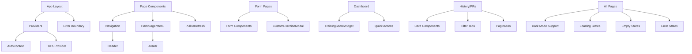

# RYTHM Mobile App - Component Architecture Visualization

**Generated:** October 10, 2025  
**App Type:** Progressive Web App (PWA)  
**Framework:** Next.js 14 with App Router

---

## 📱 Application Structure

```
RYTHM Mobile App
├── Root Layout (layout.tsx)
│   ├── Providers (AuthContext, TRPCProvider)
│   └── Error Boundary
│
├── 🏠 Landing Page (/)
│   └── Marketing/Welcome Screen
│
├── 🔐 Authentication Flow (/auth/*)
│   ├── Login Page
│   ├── Register Page
│   ├── Forgot Password
│   └── Reset Password
│
├── 📊 Main Application
│   ├── Dashboard (/dashboard)
│   ├── Training Section (/training)
│   ├── History (/history)
│   ├── Personal Records (/prs)
│   ├── Analytics (/analytics)
│   ├── Calendar (/calendar)
│   ├── Templates (/templates)
│   ├── Profile (/profile)
│   └── Settings (/settings)
│
└── 🔧 Components Library
    ├── Navigation Components
    ├── UI Components
    ├── Form Components
    └── Widget Components
```

---

## 🎯 Core Components

### **Navigation Components**
```
Navigation.tsx
├── Header Component
│   ├── Logo/Title
│   ├── Back Button (conditional)
│   └── Action Buttons
│
└── HamburgerMenu.tsx
    ├── Slide-out Menu
    ├── User Avatar
    ├── Navigation Links
    │   ├── Dashboard
    │   ├── Training
    │   ├── History
    │   ├── PRs
    │   ├── Analytics
    │   ├── Calendar
    │   ├── Templates
    │   ├── Profile
    │   └── Settings
    └── Logout Button
```

### **UI Components**
```
Avatar.tsx
├── User Profile Picture
├── Fallback Initials
└── Status Indicator

ErrorBoundary.tsx
├── Error Catching
├── Fallback UI
└── Error Logging

PullToRefresh.tsx
├── Gesture Detection
├── Loading Spinner
└── Refresh Callback

Feedback.tsx
├── Toast Notifications
├── Success Messages
└── Error Alerts
```

### **Form Components**
```
Form.tsx
├── Input Fields
│   ├── Text Input
│   ├── Number Input
│   ├── Date Picker
│   └── Textarea
├── Validation
└── Error Display

CustomExerciseModal.tsx
├── Modal Overlay
├── Exercise Form
│   ├── Name Input
│   ├── Category Select
│   ├── Equipment Select
│   └── Description
└── Action Buttons
```

### **Widget Components**
```
TrainingScoreWidget.tsx
├── Score Display
├── Progress Indicator
├── Trend Chart
└── Quick Stats
```

---

## 📄 Page Structure & Components

### **🏠 Landing/Home Page (`/`)**
```
Landing Page
├── Hero Section
├── Feature Highlights
├── CTA Buttons
│   ├── Login
│   └── Register
└── App Description
```

### **🔐 Authentication Pages (`/auth/*`)**

#### Login Page (`/auth/login`)
```
Login Page
├── Header
├── Login Form
│   ├── Email Input
│   ├── Password Input
│   ├── Remember Me Checkbox
│   └── Login Button
├── Forgot Password Link
├── Register Link
└── Error Display
```

#### Register Page (`/auth/register`)
```
Register Page
├── Header
├── Registration Form
│   ├── First Name Input
│   ├── Last Name Input
│   ├── Email Input
│   ├── Password Input
│   ├── Confirm Password Input
│   └── Register Button
├── Terms & Conditions
├── Login Link
└── Error Display
```

#### Forgot Password (`/auth/forgot-password`)
```
Forgot Password
├── Header
├── Email Form
│   ├── Email Input
│   └── Submit Button
├── Success Message
└── Back to Login Link
```

#### Reset Password (`/auth/reset-password`)
```
Reset Password
├── Header
├── Password Reset Form
│   ├── New Password Input
│   ├── Confirm Password Input
│   └── Reset Button
├── Token Validation
└── Success/Error Display
```

---

### **📊 Dashboard (`/dashboard`)**
```
Dashboard Page
├── Header (Navigation)
├── HamburgerMenu
├── Welcome Section
│   └── User Greeting
├── Training Score Widget
│   ├── Current Score
│   ├── Trend Indicator
│   └── Quick Stats
├── Quick Actions
│   ├── Start Training
│   ├── View History
│   ├── Track PR
│   └── View Analytics
├── Recent Activity
│   ├── Last Workout
│   ├── Recent PRs
│   └── Upcoming Sessions
└── Bottom Navigation (Mobile)
```

---

### **🏋️ Training Section (`/training/*`)**

#### Training History (`/training/history`)
```
Training History
├── Header
├── HamburgerMenu
├── Filter Tabs
│   ├── All
│   ├── Strength
│   └── Cardio
├── PullToRefresh
├── Session Cards List
│   └── Session Card
│       ├── Exercise Name
│       ├── Category Badge
│       ├── Date/Time
│       ├── Duration
│       ├── Set Count
│       └── Notes Preview
├── Pagination Controls
└── Empty State
```

#### Training Day View (`/training/history/day/[date]`)
```
Training Day View
├── Header (with Date)
├── Back Button
├── Date Selector
├── Sessions List
│   └── Session Card
│       ├── Exercise Info
│       ├── Sets Summary
│       ├── Duration
│       └── View Details Button
└── Add Session Button
```

#### Session Detail (`/training/view/[id]`)
```
Session Detail
├── Header (Exercise Name)
├── Back Button
├── Session Info Card
│   ├── Exercise Name
│   ├── Category Badge
│   ├── Date/Time
│   ├── Duration
│   └── Notes
├── Sets List
│   └── Set Card
│       ├── Set Number
│       ├── Reps/Duration
│       ├── Weight/Distance
│       ├── RPE
│       ├── Notes
│       ├── Edit Button
│       └── Delete Button
├── Add Set Button
├── Session Actions
│   ├── Edit Session
│   └── Delete Session
└── Performance Charts (optional)
```

---

### **📜 History Page (`/history`)**
```
History Page
├── Header
│   ├── Title
│   └── Subtitle
├── HamburgerMenu
├── Filter Tabs
│   ├── All Sessions
│   ├── Strength
│   └── Cardio
├── PullToRefresh
├── Session Cards
│   └── Session Card
│       ├── Exercise Name
│       ├── Category Badge
│       ├── Date Icon + Date
│       ├── Clock Icon + Duration
│       ├── Set Count
│       └── Notes (truncated)
├── Pagination
│   ├── Page Info
│   ├── Previous Button
│   └── Next Button
├── Empty State
│   ├── Trophy Icon
│   ├── Message
│   └── CTA Button
└── Loading State (Spinner)
```

---

### **🏆 Personal Records (`/prs/*`)**

#### PR List Page (`/prs`)
```
PR List Page
├── Header
│   ├── Title: "Personal Records - PR's"
│   └── Subtitle
├── HamburgerMenu
├── Filter Tabs
│   ├── All Records
│   ├── Strength
│   └── Cardio
├── PullToRefresh
├── PR Cards List
│   └── PR Card
│       ├── Exercise Name
│       ├── Category Badge
│       ├── Metric Name
│       ├── Current Value (Large)
│       ├── Current Unit
│       ├── Date Achieved
│       ├── Record Count
│       └── Notes Preview
├── Pagination Controls
├── Add PR Button (Bottom)
│   └── Full-width CTA
└── Empty State
    ├── Trophy Icon
    ├── Message
    └── Add PR Button
```

#### Add PR Form (`/prs/new`)
```
Add PR Form
├── Header ("Add Personal Record")
├── Back Button
├── Exercise Selection Card
│   ├── Label
│   ├── Search Button/Input
│   └── Exercise Picker Modal
│       ├── Search Input
│       └── Exercise List
│           └── Exercise Item
│               ├── Name
│               └── Category
├── Metric Name Card
│   ├── Label
│   ├── Text Input
│   └── Helper Text
├── Category Selection Card
│   ├── Label
│   └── Toggle Buttons
│       ├── Strength (Blue)
│       └── Cardio (Green)
├── Value Input Card
│   ├── Label
│   ├── Numeric Input
│   ├── Unit Input
│   └── Helper Text
├── Date Picker Card
│   ├── Label
│   └── Date Input
├── Notes Card
│   ├── Label
│   └── Textarea
└── Submit Button
    └── "Create Personal Record"
```

#### PR Detail Page (`/prs/[id]`)
```
PR Detail Page
├── Header (Exercise Name)
├── Back Button
├── PR Info Card
│   ├── Metric Name
│   ├── Exercise Name
│   ├── Category Badge
│   ├── Current Record Highlight
│   │   ├── Label
│   │   ├── Value (Large)
│   │   └── Date Achieved
│   ├── Notes Section
│   └── Action Buttons
│       ├── Add Record (Blue)
│       └── Edit PR (Gray)
├── History Section
│   ├── Header ("History")
│   ├── Record Count
│   └── History Cards
│       └── Record Card
│           ├── Value (Large)
│           ├── Unit
│           ├── Current Badge (if current)
│           ├── Date
│           ├── Notes
│           ├── Delete Button
│           └── Progress Indicator
│               ├── ↑ Improvement (Green)
│               └── ↓ Decrease (Red)
└── Delete PR Button
    ├── Warning Style (Red)
    └── Confirmation Dialog
```

#### Add Record Form (`/prs/[id]/add-record`)
```
Add Record Form
├── Header ("Add Record")
├── Back Button
├── PR Context
│   ├── Exercise Name
│   └── Metric Name
├── Value Input Card
│   ├── Numeric Input
│   ├── Unit Input (pre-filled)
│   └── Helper Text
├── Date Picker Card
│   └── Date Input
├── Notes Card
│   └── Textarea
└── Submit Button
```

#### Edit PR Form (`/prs/[id]/edit`)
```
Edit PR Form
├── Header ("Edit PR")
├── Back Button
├── Metric Name Card
│   └── Text Input
├── Notes Card
│   └── Textarea
└── Save Button
```

---

### **📊 Analytics Page (`/analytics`)**
```
Analytics Page
├── Header
├── HamburgerMenu
├── Date Range Selector
│   ├── Start Date
│   └── End Date
├── Category Filter
│   ├── All
│   ├── Strength
│   └── Cardio
├── Key Metrics Cards
│   ├── Total Workouts
│   ├── Total Volume
│   ├── Total Duration
│   └── Average Session Time
├── Charts Section
│   ├── Volume Trend Chart
│   ├── Frequency Chart
│   ├── Category Distribution
│   └── PR Progress Chart
├── Top Exercises List
│   └── Exercise Card
│       ├── Name
│       ├── Session Count
│       ├── Total Volume
│       └── Last Performed
└── Export Options
    ├── Export CSV
    └── Export PDF
```

---

### **📅 Calendar Page (`/calendar`)**
```
Calendar Page
├── Header
├── HamburgerMenu
├── Month/Year Selector
├── Calendar Grid
│   └── Day Cell
│       ├── Date Number
│       ├── Workout Indicator
│       ├── Session Count
│       └── Click Handler
├── Selected Day Details
│   ├── Date Header
│   ├── Sessions List
│   │   └── Session Summary
│   │       ├── Exercise Name
│   │       ├── Category
│   │       └── Duration
│   └── Add Session Button
└── Legend
    ├── Strength (Blue)
    ├── Cardio (Green)
    └── Hybrid (Purple)
```

---

### **📝 Templates Page (`/templates`)**
```
Templates Page
├── Header
├── HamburgerMenu
├── Search Bar
├── Category Filter
│   ├── All
│   ├── Strength
│   └── Cardio
├── Equipment Filter
├── Template Cards List
│   └── Template Card
│       ├── Exercise Name
│       ├── Category Badge
│       ├── Muscle Groups
│       ├── Equipment
│       ├── Exercise Type
│       ├── Default Value Types
│       ├── Description
│       └── Use Template Button
├── Add Custom Exercise Button
└── CustomExerciseModal
    ├── Modal Overlay
    ├── Exercise Form
    │   ├── Name Input
    │   ├── Category Select
    │   ├── Muscle Groups (Multi-select)
    │   ├── Equipment Select
    │   ├── Exercise Type
    │   ├── Default Value Types
    │   ├── Description
    │   └── Instructions
    └── Save/Cancel Buttons
```

---

### **👤 Profile Page (`/profile`)**
```
Profile Page
├── Header
├── HamburgerMenu
├── Avatar Section
│   ├── Profile Picture
│   ├── Upload Button
│   └── User Name
├── Personal Info Card
│   ├── First Name
│   ├── Last Name
│   ├── Email
│   └── Edit Button
├── Stats Card
│   ├── Total Workouts
│   ├── Total PRs
│   ├── Member Since
│   └── Current Streak
├── Preferences Card
│   ├── Units (Metric/Imperial)
│   ├── Theme (Light/Dark)
│   └── Notifications Toggle
└── Account Actions
    ├── Change Password
    ├── Export Data
    └── Delete Account
```

---

### **⚙️ Settings Page (`/settings`)**
```
Settings Page
├── Header
├── HamburgerMenu
├── General Settings
│   ├── Language
│   ├── Theme
│   └── Units
├── Notification Settings
│   ├── Push Notifications
│   ├── Email Notifications
│   └── Workout Reminders
├── Privacy Settings
│   ├── Profile Visibility
│   └── Data Sharing
├── App Settings
│   ├── Auto-save Workouts
│   ├── Offline Mode
│   └── Cache Management
├── About Section
│   ├── App Version
│   ├── Terms of Service
│   ├── Privacy Policy
│   └── Contact Support
└── Danger Zone
    ├── Clear Cache
    ├── Reset App
    └── Delete Account
```

---

## 🎨 Design System Components

### **Color Categories**
```
Category Colors:
├── Strength: Blue (blue-600)
│   ├── Primary: #2563EB
│   ├── Light: blue-100
│   └── Dark: blue-900
├── Cardio: Green (green-600)
│   ├── Primary: #16A34A
│   ├── Light: green-100
│   └── Dark: green-900
└── Hybrid: Purple (purple-600)
    ├── Primary: #9333EA
    ├── Light: purple-100
    └── Dark: purple-900
```

### **Card Components**
```
Card Variants:
├── Basic Card
│   ├── White/Gray-800 Background
│   ├── Rounded Corners (rounded-lg)
│   ├── Shadow (shadow-sm)
│   └── Border (border-gray-200)
├── Clickable Card
│   ├── Basic Card +
│   ├── Hover Effect (border-blue-500)
│   └── Cursor Pointer
└── Highlighted Card
    ├── Basic Card +
    ├── Colored Border
    └── Enhanced Shadow
```

### **Button Components**
```
Button Variants:
├── Primary Button
│   ├── Blue Background (bg-blue-600)
│   ├── White Text
│   ├── Hover (bg-blue-700)
│   └── Shadow
├── Secondary Button
│   ├── Gray Background (bg-gray-100)
│   ├── Dark Text
│   ├── Hover (bg-gray-200)
│   └── No Shadow
├── Destructive Button
│   ├── Red Background (bg-red-50)
│   ├── Red Text (text-red-600)
│   ├── Hover (bg-red-100)
│   └── Border (border-red-200)
└── Icon Button
    ├── Transparent Background
    ├── Icon Only
    └── Hover Effect
```

### **Badge Components**
```
Badge Variants:
├── Category Badge
│   ├── Small Rounded (rounded-full)
│   ├── Colored Background
│   ├── Colored Text
│   └── px-2.5 py-0.5
├── Status Badge
│   ├── Pill Shape
│   ├── Status Color
│   └── Text Indicator
└── Count Badge
    ├── Circular
    ├── Notification Style
    └── Small Size
```

---

## 🔄 State Management

### **Context Providers**
```
App State Management:
├── AuthContext
│   ├── User State
│   ├── Login/Logout
│   ├── Token Management
│   └── withAuth HOC
└── TRPCProvider
    ├── API Client
    ├── Query Cache
    └── Mutation Handling
```

### **Data Flow**
```
Data Flow Architecture:
┌─────────────┐
│   Page      │
│ Component   │
└──────┬──────┘
       │
       ▼
┌─────────────┐
│   tRPC      │
│   Hook      │
└──────┬──────┘
       │
       ▼
┌─────────────┐
│   API       │
│   Client    │
└──────┬──────┘
       │
       ▼
┌─────────────┐
│  Backend    │
│    API      │
└──────┬──────┘
       │
       ▼
┌─────────────┐
│ PostgreSQL  │
│  Database   │
└─────────────┘
```

---

## 📱 Responsive Design

### **Breakpoints**
```
Responsive Breakpoints:
├── Mobile (< 640px)
│   ├── Single Column Layout
│   ├── Full Width Components
│   └── Bottom Navigation
├── Tablet (640px - 1024px)
│   ├── Adapted Layout
│   ├── Side Navigation
│   └── Max Width Containers
└── Desktop (> 1024px)
    ├── Multi-column Layout
    ├── Max Width: 1280px
    └── Enhanced Spacing
```

### **Mobile-First Components**
```
Mobile Optimizations:
├── Touch Targets (min 44px)
├── Swipe Gestures
│   ├── Pull to Refresh
│   └── Swipe to Delete
├── Bottom Sheets
├── Fixed Bottom CTAs
└── Collapsible Sections
```

---

## 🔌 Integration Points

### **External Services**
```
External Integrations:
├── Azure Services
│   ├── Container Apps (Hosting)
│   ├── PostgreSQL (Database)
│   ├── Key Vault (Secrets)
│   └── Communication Services (Email)
├── Authentication
│   └── JWT Tokens
└── Analytics (Optional)
    └── Application Insights
```

---

## 📦 Component Dependencies



---

## 🎯 Key Features by Component

### **Common Features Across Pages**
- ✅ Dark Mode Support
- ✅ Loading States (Spinners)
- ✅ Error States (Error Boundaries)
- ✅ Empty States (Helpful Messages)
- ✅ Pull to Refresh
- ✅ Responsive Design
- ✅ Touch-Friendly UI
- ✅ Keyboard Navigation
- ✅ Accessibility (ARIA labels)

### **Navigation Features**
- ✅ Hamburger Menu (Slide-out)
- ✅ Back Button Navigation
- ✅ Bottom Tab Bar (Mobile)
- ✅ Breadcrumb Navigation
- ✅ Deep Linking Support

### **Data Management**
- ✅ Optimistic Updates
- ✅ Real-time Sync
- ✅ Offline Support (PWA)
- ✅ Query Caching
- ✅ Pagination
- ✅ Infinite Scroll (where applicable)

---

## 📊 Component Statistics

- **Total Pages:** ~20+ pages
- **Shared Components:** 8+ reusable components
- **Context Providers:** 2 (Auth, TRPC)
- **Route Groups:** 6 main sections
- **Form Components:** Multiple complex forms
- **Widget Components:** 1+ specialized widgets

---

## 🚀 Performance Optimizations

### **Component Level**
- Code splitting per route
- Lazy loading for modals
- Memoization for expensive computations
- Virtual scrolling for long lists
- Image optimization

### **Data Level**
- Query caching
- Prefetching
- Optimistic updates
- Debounced search
- Pagination

---

## 📝 Notes

This visualization represents the current state of the RYTHM mobile PWA. The architecture follows Next.js 14 App Router patterns with a focus on:

1. **Modularity**: Reusable components
2. **Performance**: Optimized rendering
3. **UX**: Mobile-first design
4. **Accessibility**: WCAG compliant
5. **Maintainability**: Clear component structure

---

**Last Updated:** October 10, 2025  
**Version:** 1.0.0  
**Status:** Production Ready ✅
